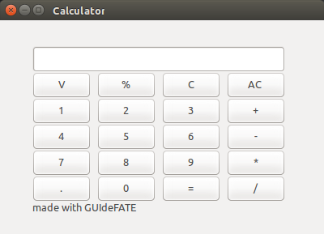

# GUIDeFATE
GUI Design From A Text Editor

Designing a graphical User interface requires knowledge of things like toolkit libraries, platform context etc.  At least I think it does.  I am a relatively new programmer in that I have near zero experience in GUI programming outside a web page.  So when I explore how to design an application which works outside a command line or a browser window, I feel tremenously out of my depth.  When I see the programming interfaces to these interfaces (QT, GTK, TK, ncurses, HTML) my bewilderment reaches even greater heights.

Sure there are clever things like wxGlade, and QT Designer etc.  These are tools that also require more skill than I possess; I am old and I can just about use a text editor as an IDE. So what is needed? I need a GUI designer that: -
1) Is simple, abstracting away from the underlying Toolkit/platform
2) Requires the simplest designer possible, with a visual representation of the interface
3) Allows the use use of multiple different GUI engines
4) Makes it easy recognise the interface elements by simply looking at the code

# So how might this work?

The user uses a text editor to design the window. Not new of course...text editors have had to be used to describe windows when other graphical representation methods were not possible.  As this is already a two dimensional data, it should be possible to convert this into an actual graphical interface through an interpreter.  The developer simply has to draw the interface in text and then program the interaction that is required.

# Textual Representation of a Graphical Interface

A simple hellow world
```
+------------------+
|T Message         |
+------------------+
|                  |
|  Hello World! !  |
|                  |
+------------------+
```
A Calculator
```
+------------------------+
|T  Calculator           |
+------------------------+
|  [__________________]  |
|  { V }{ % }{ C }{AC }  |
|  { 1 }{ 2 }{ 3 }{ + }  |
|  { 4 }{ 5 }{ 6 }{ - }  |
|  { 7 }{ 8 }{ 9 }{ * }  |
|  { . }{ 0 }{ = }{ / }  |
+------------------------+
```

# Example PERL script

```perl
#!/usr/bin/perl -w
use strict;
use GUIDeFATE;
use GUIDeFATE qw<$frame>;
package Main;

my $window=<<END;
+------------------------+
|T  Calculator           |
+------------------------+
|  [                  ]  |
|  { V }{ % }{ C }{AC }  |
|  { 1 }{ 2 }{ 3 }{ + }  |
|  { 4 }{ 5 }{ 6 }{ - }  |
|  { 7 }{ 8 }{ 9 }{ * }  |
|  { . }{ 0 }{ = }{ / }  |
+------------------------+

END

GUIDeFATE::convert($window);
my $gui=GUIDeFATE->new();
$gui->MainLoop;
```
This produces something like 
